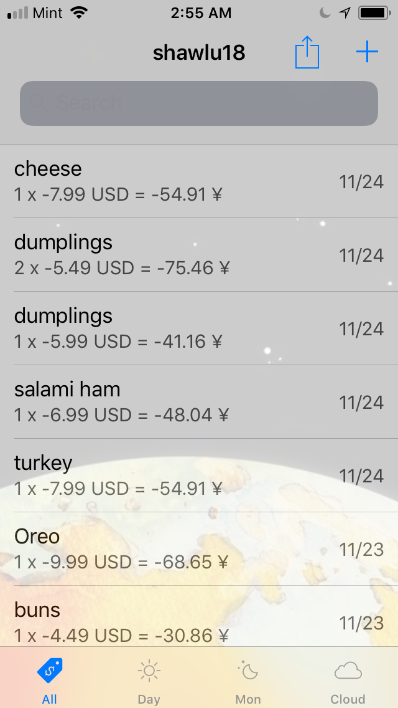
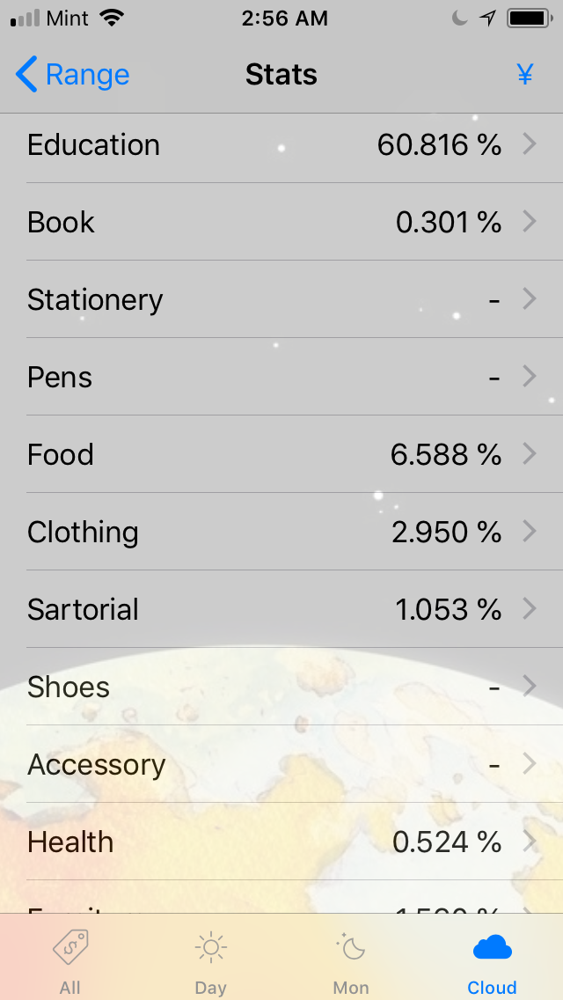
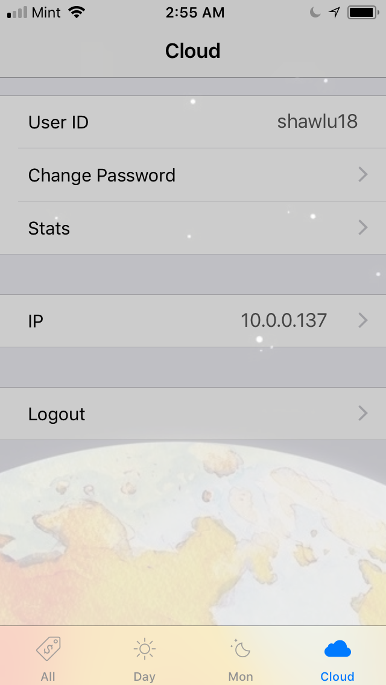
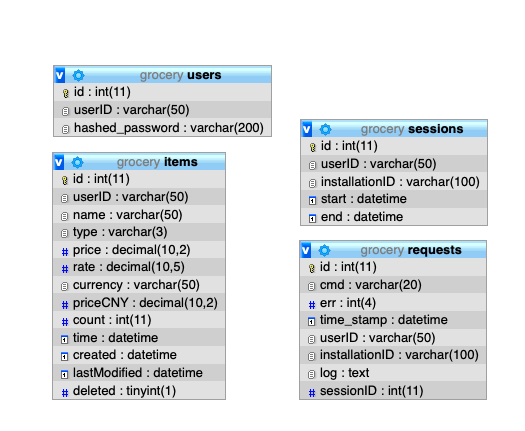

# Grocery Matter

This is a bookkeeping iOS app for personal finance, with Python code to run SQL analytics. I built this bookkeeping app three years ago as a programming exercise, but it has become one of my daily companion apps. For the past three years, I have been using this app to keep track of my living expenses, insurance, tuition, rent and tax. It helped me analyze my expenses by categories, by time, and by quantity. It helped me keep track of every penny I spent, exercise financial discretion, forecast future expense and bank saving. Its only disadvantage is its inability to predict how much I'm going to lose in the stock market.

The repository consists of four parts. The iOS front-end app is coded in Objective-C. The server is programmed in PHP, which interfaced with MySQL relational database client via object-oriented design. Finally, a Python module is available for connecting with the database, retrieving data as Pandas dataframe, and conducting analytics in the most flexible manner.

### iOS App
The app is removed from the app store and must be run on your device through xcode. To run this app, you may need to change bundle identifier and development team.

<p align="center">
  
  
  
</p>

### PHP Server
Install MAMP/WAMP/XAMPP. Copy the entire [server](server/) folder to your localhost home directory (htdocs for MAMP). To get started, follow the steps below:
1. Change the server IP address in the [Macros.h](iOS/Grocery/Model/Macros.h) file. The macro should end with the server directory. In the simulator, substitute ServerIP with "localhost" is fine. To work in a real iOS device, a genuine IP address must be provided. The localhost computer must be connected to the same IP address via wifi (of course, feel free to rent a AWS instance).
```Objective-C
#define ServerURL   [NSString stringWithFormat:@"http://%@:7777/server", ServerIP]
```

2. In the [conf_db.php](server/includes/conf_db.php) file, change DB_SERVER, DB_USER, DB_PASS, DB_NAME according to your localhost setup. The DB_USER must have universal privilege on the grocery dataset.
````PHP
<?php
defined('DB_SERVER') ? null : define("DB_SERVER", "localhost");
defined('DB_USER')   ? null : define("DB_USER", "privateuser");
defined('DB_PASS')   ? null : define("DB_PASS", "1234567");
defined('DB_NAME')   ? null : define("DB_NAME", "grocery");
?>
````

3. Load the SQL schema [schema.sql](sql/schema.sql) to the MySQL database. MAMP makes it easy. Just load the file in phpMyAdmin would suffice.

<p align="center">
    
</p>

### MySQL Schema

To achieve supreme simplicity, only four tables were designed.

* users: you may easily register multiple accounts to keep track of different bank accounts. For me, I just have one personal account to track everything I spent. I also have an official account to keep track of the cash flow of the Chinese student clubs (where I serve as the financial officer). Users have one-to-many relation with items, requests, and sessions

* items: this is the centerpiece of the app. All your earnings, expenses, capital losses are stored here. I save the expense both in US dollars and Chinese yuans, pulling real-time exchange rate from the Forex. You can customize currency options by editing the following function in the item.m file.

```Objective-C
+ (NSNumber *)priceCNYForItemPaidInCurrency:(NSString *)currency inAmount:(NSNumber *)amount
```

* requests: this is the log of all network traffic. Every request is documented: time, command, input and output.

* sessions: session has a one-to-many relationship with requests. A user has a one-to-many relationship with sessions.

### Python Analytics
The module [analytics.py](analytics/analytics.py) offers a convenient way to instantiate a SQL client, retrieve data from the database, and return data as a Pandas dataframe. Do not try to modify data from the client (no safety checks). See notebook [analytics.ipynb](analytics/analytics.ipynb) for specific use case.

In 2018 November, I spent 60.8% of my cash outflow on tuition ($3983.87), 18.5% on housing ($1209.07), 6.6% on food ($431.53). The remaining categories constitute 14.1% of my expense (well, the life of a full-time student). To customize your categories (e.g. beer, fines, dogs), follow instruction in line 34-40 in [Macros.h](iOS/Grocery/Model/Macros.h).

<p align="center">
  
  
</p>

For the entire year of 2018, 33.2% of my money went to Stanford ($31.2k); 16.2% went to house rent ($15.2k), and 14.8% went to the Wall Street ($14k) as I couldn't wait to blow up my first brokerage account - RIP my hard-earned internship money. 

Of course, you can run SQL query in terminal however you like. Below are my purchase history of dairy products from 2016 to 2018. My financial history dates back to early 2015, but I'd spare you the torture of reviewing it in entirety. 

```bash
mysql> SELECT userID, name, price, count, time FROM items WHERE name LIKE '%milk%';
+----------+---------------------------+--------+-------+---------------------+
| userID   | name                      | price  | count | time                |
+----------+---------------------------+--------+-------+---------------------+
| shawlu16 | milk tea                  | -20.00 |     1 | 2016-11-23 23:46:20 |
| shawlu16 | Pearl Milk Tea (Yas Mall) | -20.00 |     1 | 2016-11-26 23:46:20 |
| shawlu16 | Milk Tea                  | -20.00 |     1 | 2016-11-30 12:17:02 |
| shawlu16 | Milk Tea                  | -20.00 |     1 | 2016-12-19 12:17:02 |
| shawlu16 | Soya milk                 |  -3.59 |     1 | 2016-01-26 02:36:22 |
| shawlu16 | Milk                      |  -6.00 |     1 | 2016-01-26 02:36:22 |
| shawlu16 | bread milk                | -10.00 |     1 | 2016-03-08 02:36:22 |
| shawlu16 | water, milk               | -16.00 |     1 | 2016-04-23 01:36:22 |
| shawlu16 | battery, milk             | -15.00 |     1 | 2016-05-01 01:36:22 |
| shawlu16 | milk tea                  | -20.00 |     1 | 2016-05-29 01:36:22 |
| shawlu17 | milk tea                  | -18.00 |     1 | 2017-04-04 17:53:00 |
| shawlu17 | milk                      |  -6.50 |     1 | 2017-07-08 00:01:56 |
| shawlu17 | milk                      |  -3.29 |     1 | 2017-09-12 08:46:43 |
| shawlu17 | milk tea                  |  -3.50 |     1 | 2017-10-22 20:53:04 |
| shawlu18 | milk                      |  -4.19 |     1 | 2018-01-09 21:30:27 |
| shawlu18 | milk                      |  -3.99 |     1 | 2018-01-20 21:30:27 |
| shawlu18 | milk                      |  -3.99 |     1 | 2018-01-20 21:30:27 |
| shawlu18 | soymilk                   |  -3.49 |     1 | 2018-01-21 21:30:27 |
| shawlu18 | skim milk                 |  -4.99 |     2 | 2018-01-26 21:30:27 |
| shawlu18 | milk tea                  |  -4.00 |     1 | 2018-04-21 21:30:27 |
| shawlu18 | milk                      |  -1.99 |     1 | 2018-05-06 21:30:27 |
| shawlu18 | milk tea                  |  -4.00 |     1 | 2018-05-11 19:52:29 |
| shawlu18 | milk                      |  -1.99 |     1 | 2018-06-27 21:30:27 |
| shawlu18 | milk                      |  -1.99 |     1 | 2018-08-18 21:30:27 |
| shawlu18 | milk                      |  -4.49 |     3 | 2018-08-24 21:30:27 |
| shawlu18 | milk tea                  |  -8.99 |     1 | 2018-09-15 21:30:27 |
| shawlu18 | milk                      |  -3.99 |     1 | 2018-11-09 21:30:27 |
| shawlu18 | milk                      |  -3.99 |     1 | 2018-11-23 21:30:27 |
+----------+---------------------------+--------+-------+---------------------+
28 rows in set (0.01 sec)
```
